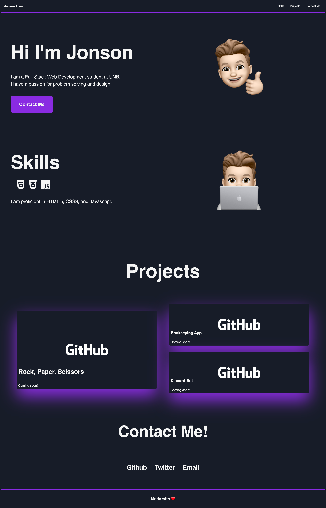

# Jonson's Portfolio

## Description
This is a Portfolio website that shows off my work to potential employers. The website was built using HTML5 and CSS3 languages. The webpage includes a section About Me, Skills, Projects, and Contact Me section.

I built this webpage so future employers have a webpage to be able to visit and see my projects.

In the process I learned how to utilize flexbox and Grid together to create a responsive website.

## Installation

You will need a browser installed on your local machine to run this application. Follow these steps: 

1. Clone the reopsitory with the follwoing command: 'git clone https://github.com/StunnaDawg/Portfolio

2. cd into the repository on your local machine

3. Open the index.html with your default browser

## Usage

This webpage is to be used to host my projects for potential employers to view. 

## License
N/A

## Credits

- Icons : https://fontawesome.com/
